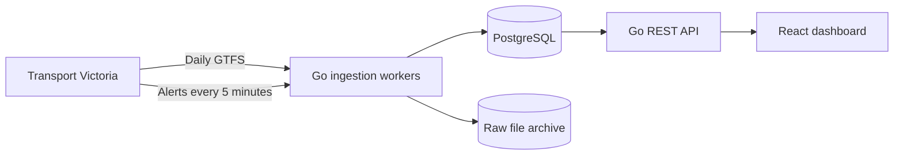

# Transit Observatory

Transit Observatory is a public dashboard for exploring disruptions across Melbourne's metropolitan train network. It collects Transport Victoria data throughout the day, keeps a history of how alerts change, and turns that history into line-level analytics.

- [Live dashboard](https://web-production-81e21.up.railway.app)
- [API status](https://api-production-985a.up.railway.app/api/v1/status)

## Why I Built It

Current service alerts are easy to find, but it is much harder to understand how often disruptions happen or how they change over time. This project creates that missing history while also providing a useful view of the network right now.

## What It Does

- Checks GTFS-Realtime service alerts every five minutes.
- Imports the static GTFS network each day.
- Shows current and upcoming disruptions, including replacement bus services.
- Lets users explore lines, stations, alert history, and daily or weekly trends.
- Keeps raw source files so every import can be traced back to the original data.
- Reports data freshness and ingestion failures through the API.

## Current Scale

The current GTFS import processes a 286 MB source archive containing:

- 35,665 scheduled trips
- 599,306 stop-time records
- 2,859 stops across 226 stations
- 35 train and replacement bus routes

## Architecture



The workers collect and clean the source data before saving it to PostgreSQL. Raw files are archived separately for traceability. The Go API reads from PostgreSQL and serves the React dashboard.

## Technology

- **Backend:** Go REST API and scheduled ingestion workers
- **Frontend:** React, TypeScript, and Vite
- **Data:** PostgreSQL, GTFS, and GTFS-Realtime protobuf feeds
- **Deployment:** Docker, Railway, Caddy, and S3-compatible object storage
- **Testing:** Go tests, Vitest, and GitHub Actions

## Running Locally

You will need Go 1.26, Node.js 24, Docker, and a Transport Victoria Open Data API key.

```sh
cp .env.example .env
# Add your TRANSIT_API_KEY to .env

docker compose up -d

set -a
. ./.env
set +a

go run ./cmd/worker migrate
go run ./cmd/worker ingest-gtfs
go run ./cmd/worker ingest-alerts
go run ./cmd/api
```

In another terminal, start the frontend:

```sh
cp web/.env.example web/.env
npm --prefix web ci
npm --prefix web run dev
```

The dashboard will be available at `http://localhost:5173`.

## Checks

```sh
go test ./...
go vet ./...
npm --prefix web test
npm --prefix web run lint
npm --prefix web run build
```

## Limitations

- The project currently covers Melbourne metropolitan trains only.
- Historical data begins from the date the service started collecting alerts.
- The analytics describe observed service alerts, not passenger impact or on-time performance.
